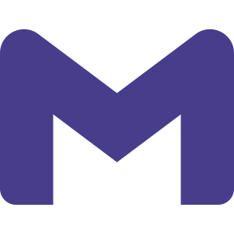

## Hi👋 My name is Andrii Veduta ✨ Welcome to my profile. 

### I'm a frontend developer, crafting user-friendly web interfaces.
Feel free to check out the projects and skills I've worked on below.

🌍 I'm based in Poland, Piotrków Trybunalski

### You can contact me by:

 
 

### ✨ Skills and Tools

        

### 👩‍💻 Studing now

 RactNative(EXPO)

### Education

- Hexlet. Course "frontend-developer". 2024 [Certificate](documents/Hexlet%20En.png)
- State Institution "Luhansk Taras Shevchenko National University"
- Educational Programme "Software Engineering"

📋 This is my [Hexlet CV](https://cv.hexlet.io/ru/resumes/4518)

## [Chat-Slack](https://github.com/Reyka141/Chat-Slack)

Chat (Slack) is a simplified version of a real-time messaging application designed for team collaboration.
This project demonstrates the use of key technologies in modern frontend development.

## [Rss-Reader](https://github.com/Reyka141/Rss-Reader)

Rss Reader is a service for convenient reading and management of RSS feeds from various sources, automatically updating and aggregating new content into a single stream.

## [Difference calculator](https://github.com/Reyka141/frontend-project-46) 

Cli- utility that compares two configuration files with each other. The comparison result can be output in different formats. Available file extensions: .json, .yml, yaml.

## [Brain Games](https://github.com/Reyka141/frontend-project-44)

Console application of 5 different mini-games that include tasks such as checking a number for parity, arithmetic operations, finding the greatest common divisor, continuing a series of numbers, checking a number for primality.

<!--

  

#### ✈️ **Open to relocation** | 💻 **Ready to work remotely**

**Reyka141/Reyka141** is a ✨ _special_ ✨ repository because its `README.md` (this file) appears on your GitHub profile.

Here are some ideas to get you started:

- 🔭 I’m currently working on ...
- 🌱 I’m currently learning ...
- 👯 I’m looking to collaborate on ...
- 🤔 I’m looking for help with ...
- 💬 Ask me about ...
- 📫 How to reach me: ...
- 😄 Pronouns: ...
- ⚡ Fun fact: ...
-->
